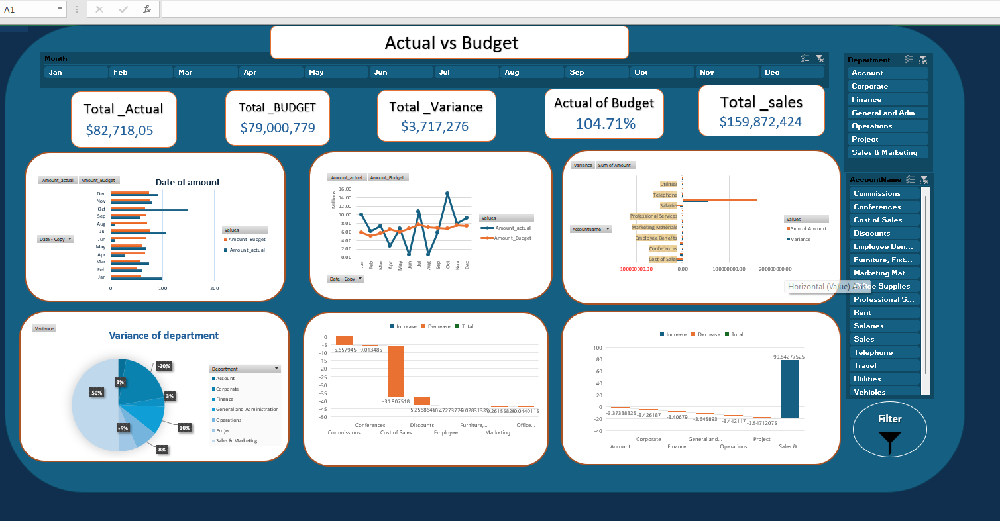
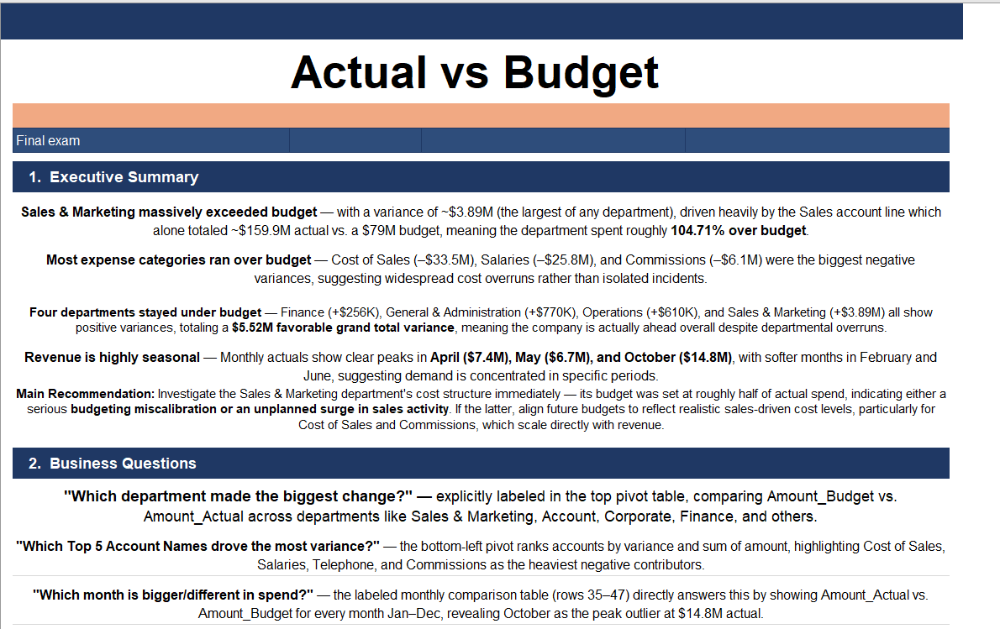
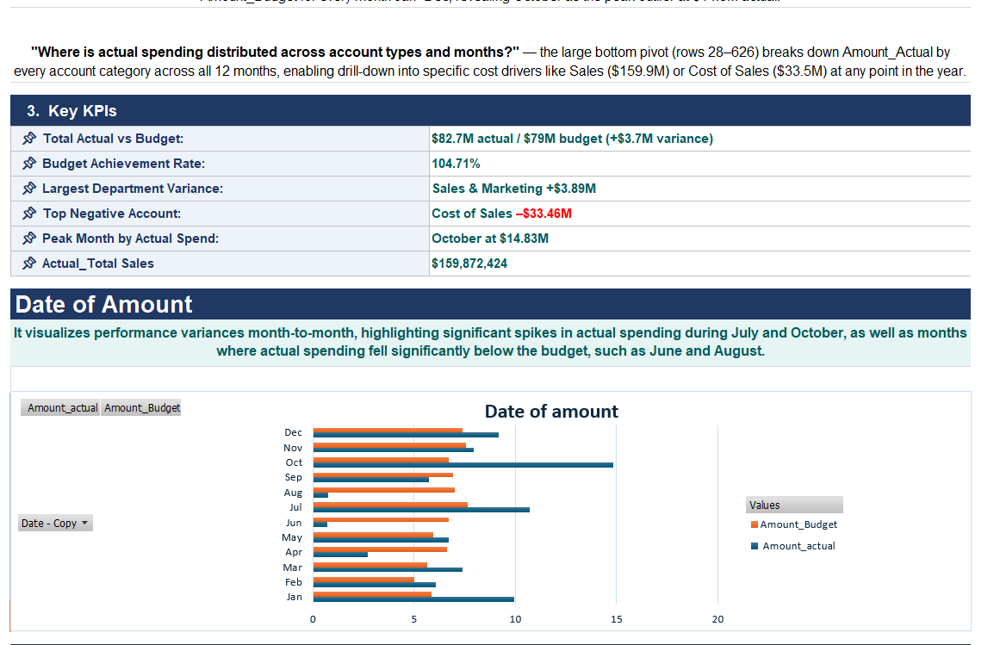
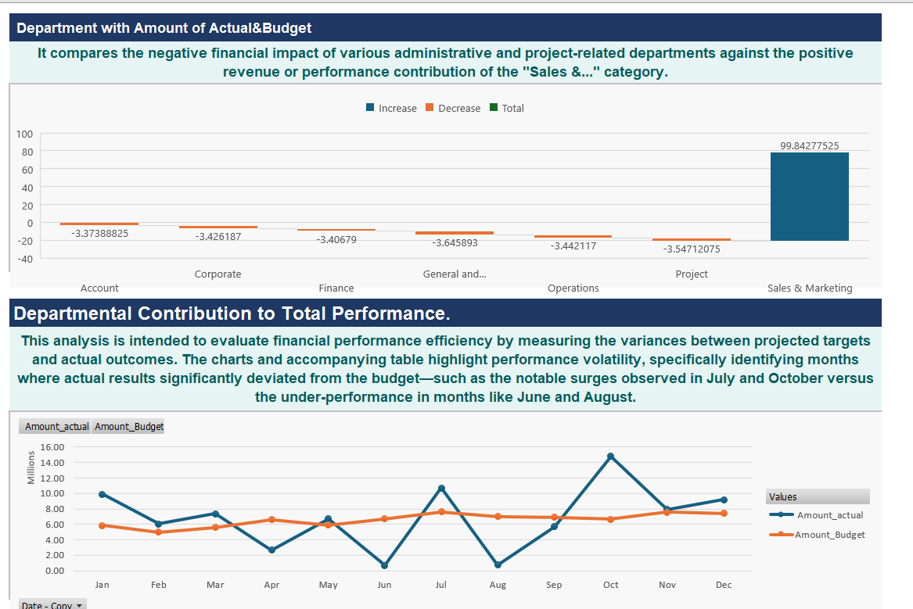
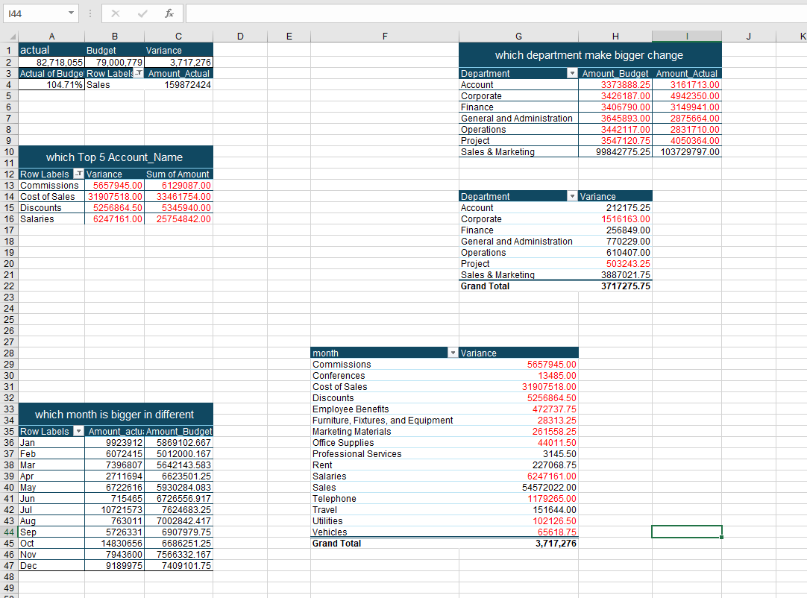

# Actual vs Budget Analysis | Excel

## Project Overview
This project is an interactive Excel financial dashboard designed to compare actual performance against budget, identify variances, analyze departments and accounts, and highlight monthly financial trends.

The goal is to transform financial data into clear insights that help monitor spending, understand cost drivers, and support better budgeting decisions.

## Business Questions
This analysis helps answer questions such as:

- How does actual spending compare with the approved budget?
- Which departments have the largest variances?
- Which accounts contribute most to budget overruns?
- Which months show the highest actual spending?
- Where are the largest positive and negative variances?
- Which cost areas require management attention?

## Key KPIs
- Total Actual: 82.7M
- Total Budget: 79.0M
- Variance: +3.7M
- Budget Achievement: 104.71%
- Largest Department Variance: Sales & Marketing ≈ +3.89M
- Peak Month: October ≈ 14.83M

## Tools Used
- Microsoft Excel
- Power Query
- Power Pivot
- Pivot Tables
- Pivot Charts
- KPI Cards
- Interactive Slicers

## Skills Demonstrated
- Financial Data Analysis
- Actual vs Budget Analysis
- Variance Analysis
- KPI Reporting
- Excel Dashboard Design
- Power Query
- Power Pivot
- Business Analysis
- Executive Reporting

## Project Workflow
1. Imported and reviewed financial data.
2. Cleaned and organized the dataset.
3. Structured the data for analysis.
4. Created Actual vs Budget calculations.
5. Calculated variance values and percentages.
6. Built Pivot Tables and Pivot Charts.
7. Designed KPI cards and interactive filters.
8. Analyzed departments, accounts, and monthly trends.
9. Created an executive summary with business insights.

## Dashboard Preview

### Executive Dashboard


### Executive Summary


### Monthly KPI Analysis


### Department Performance


### Pivot Analysis


## Key Insights
The analysis highlights:

- Differences between actual spending and budget targets
- Departments with the largest financial variances
- Cost accounts contributing heavily to spending
- Monthly spending peaks
- Areas where financial control may require additional attention

## Business Value
This project demonstrates how Excel can be used as a practical business analytics tool for financial monitoring.

The dashboard helps management compare actual performance with budget, identify cost drivers, monitor financial trends, and support more informed planning and budgeting decisions.

## Project File

[Download Actual vs Budget Analysis Workbook](workbook/Actual_vs_Budget_Analysis.xlsx)

## Repository Structure

```text
excel-actual-vs-budget-analysis/
│
├── workbook/
│   └── Actual_vs_Budget_Analysis.xlsx
│
├── screenshots/
│   ├── executive-dashboard.png
│   ├── executive-summary.png
│   ├── monthly-kpi-analysis.png
│   ├── department-performance.png
│   └── pivot-analysis.png
│
└── README.md
